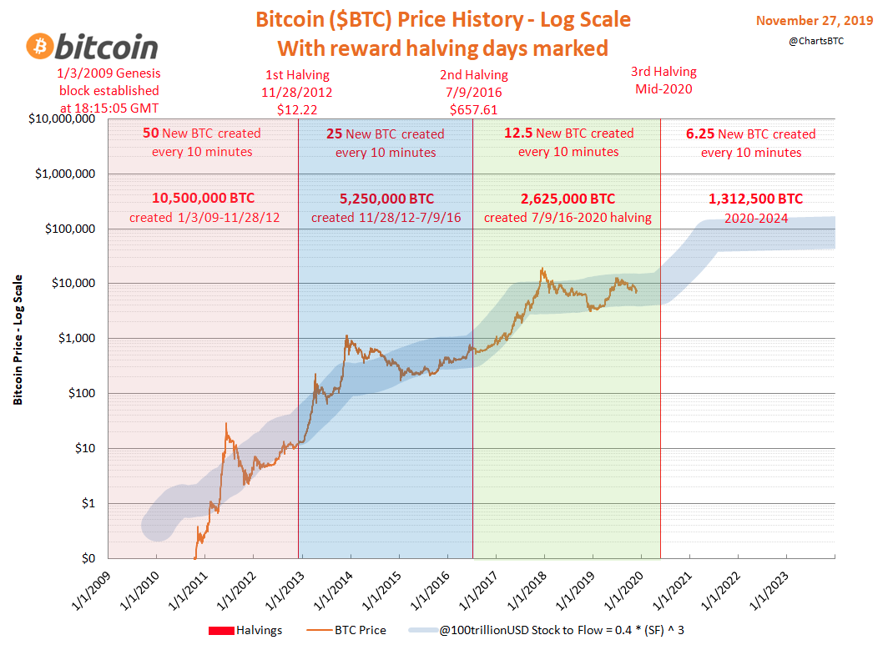
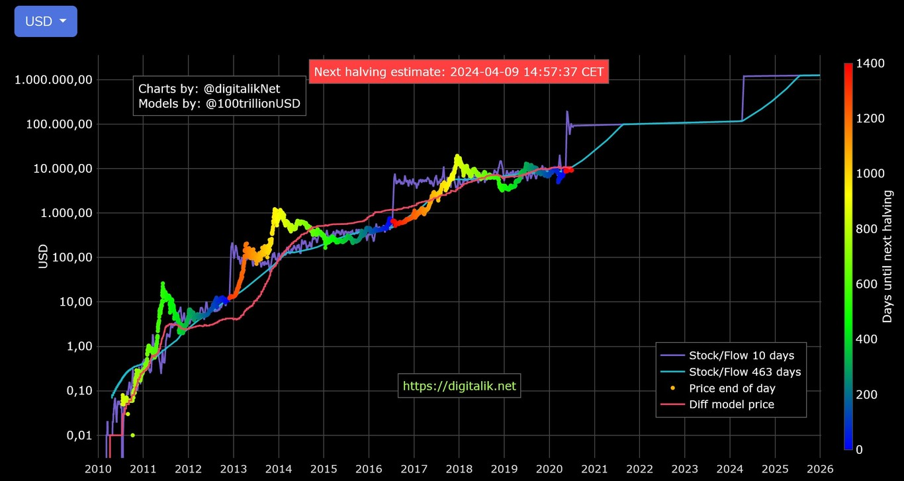

El precio del Bitcoin siempre ha sido una constante incognita. Al no estar regulado por ningun gobierno o mercado de valores su valor es facilmente manipulable y es altamente suceptible a la especulacion, esto significa que su precio puede ser manipulado con tomas agresivas de altos montos de la moneda o tambien por simples rumores. En todo caso, su precio siempre ha estado dado para que aquellos que toman el riesgo puedan ganar altas sumas de dinero.

## Inicios del Bitcoin

En el comienzo, un Bitcoin tenia un precio de **$0** dolares sin embargo, la gran acogida lo ha llevado a donde esta ahora mismo, los mas relevante en este aspecto es :

* **2010**: Usuarios de un subforo de Reddit realizan las primeras transacciones, una de las mas populares, la compra de dos pizzas por 10.000 bitcoins. A hoy serian unos 400 millones de dolares.

* **2011**: Bitcoin alcanza el valor de un dolar, un hito para aquella epoca.

* **2013**: La moneda es usada para uno de sus objetivos mas recordados, era utilizada en transacciones en el mercado negro, todo tipo de articulos ilegales se pagaban con ella. Se alcanza la cotizacion de $1.000 dolares antes de que empiece a caer.

* **2017**: Luego de años de relativa estabilidad, la moneda es impulsada por la adopcion y cada vez mas aceptacion en el mercado mundial. Esto la situa en la marca de los $19.000 dolares.

* **2020**: Como todos los mercados, se ve afectada por el Covid-19, lo que la situa en un soporte muy bajo alcanzando incluso a rozar los $1.000 dolares.

* **2021**: La recuperacion de la economia trae consigo un Bull market que propulsa a todas las criptomonedas a maximos historicos. El bitcoin alcanza los $69.000.

* **2022**: Un año bajista, pero seguramente luego de alcanzar nuevamente bajos historicos, la criptomoneda se precipitara en su camino al millon de dolares.

## Predicciones

Son muchas las personas que han intentado predecir el precio del Bitcoin a futuro, algunas basadas simplemente en su intuicion y otras utilizando modelos matematicos que parecieran mas confiables. Lo cierto es que es complicado ya que ,como dijo Nostradamus, "Las predicciones son dificiles, mas si se tratan del futuro". Aunque algunas son mucho mas aterrizadas que otras las mas prometedoras hablan de un precio del Bitcoin de $100.000 dolares en un alo entre el 2021 y el 2028, ciertamente algo que es realmente bastante sensato:

* Escala logaritmica:

Este grafico, a pesar de un tanto inexacto, tieen en cuenta el precio historico del bitcoin y lo lleva a situarlo en torno a los 100 mil dolares en algun momento de la decada del 20, lo cual es realmente bastante probable y seguramente si el bitcoin en este momento es lo bastante solido para recuperarse de cualquier desplome.

* Modelo de stock:

Este grafico es incluso mas optimista que el anterior, pero conserva algo de cordura al intentar ilustrar la continua subida de la criptomoneda, algo que seguramente sucedera a pesar de sus constantes desplomes.

## Veredicto final

Definitivamente realizar predicciones es complicado y mas aun hacer caso a aquellos que pretenden realizarlas. Sin duda, es algo peligroso intentar predecir el futuro, asi como incidir en las personas para que sigan dichas predicciones, lo cual es ademas irresponsable. Lo cierto es que no se debe tomar ninguna de estas recomendaciones en serio, el riesgo de perderlo todo es muy latente y la volatilidad es tan grande que ocasiona que los influenciadores caigan en su propio juego demasiado rapido. Tomar este tipo de opiniones en serio no es algo logico y deberian tomarse mas bien como una guia. Finalmente, el precio de los activos depende principalmente en la confianza que depositen las personas en ellos y si una persona lo suficientemente famosa deposita su confianza, muy seguramente muchos lo seguiran. Ha pasado antes con personas como Elon Musk y su ya gran conocida influencia en el precio del Doge y seguramente seguira pasando.

Te invitamos a visitarnos para [comprar y vender criptoactivos](https://shop.criptocambioslatam.com).

Para crear tu monedero virtual, lo puedes hacer a través de [este link](https://accounts.binance.com/es/register?ref=20517808).